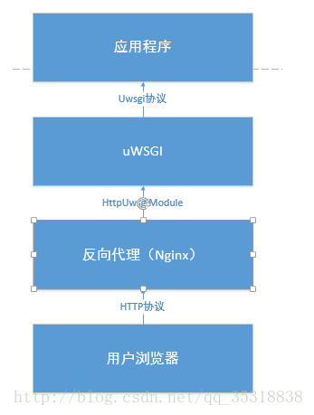

## Tutorial to deploy django using uWSGI + nginx

### Principle

1. uWSGI + nginx + Django

   ```shell
   web client <-> web server(nginx) <-> socket <-> uWSGI <-> Django
   ```

   

   photo from [飞羽喂马](http://blog.csdn.net/qq_35318838/article/details/61198183)

   Users' requests will first send to Nginx, then use a socket to transmit to uWSGI to Django

2. Actually, its totally fine to just have uWGSI, but its better to have nginx as a proxy. But it's safer to have an nginx as a reverse proxy server

   * Safer, Load balancing, IO Performance


3. More: Forward and Reverse Proxy (正向、反向代理)
   1. Forward Proxy:
      1. Browser proactively send their requests to the proxy server
   2. Reverse Proxy:
      1. Browser do not know their requests are directed to the proxy server


### Misc:

1. install

   ```shell
   pip install uwsgi
   apt-get install nginx
   ```

2. Basic command for nginx

   ```shell
   # to start service
   service nginx start
   service nginx stop
   service nginx restart
   ```

3. Set debug=false in django settings
   ```python
   DEBUG = False
   # this will result in:
   #    disable of 'static/' 'media/'
   ```

4. make a folder to store deploy needed files

   ```shell
   mkdir /path/to/your/mysite/deployfiles
   ```


### uWSGI:

1. Deploy with uWSGI instead of the original WSGI (django default)

   ```shell
   uwsgi --http :8000 --wsgi-file mysite/wsgi.py
   uwsgi --http :8000 --module mysite.wsgi
   ```

   or use a `mysite_uwsgi.ini`

   ```shell
   vim deployfiles/mysite_uwsgi.ini
   ```

   ```shell
   # mysite_uwsgi.ini

   [uwsgi]
   # http = 0.0.0.0:8000
   # socket = 127.0.0.1:8001
   socket = /path/to/your/mysite/deployfiles/mysite.sock
   chdir = /path/to/your/mysite/
   wsgi-file = /path/to/your/mysite/mysite/wsgi.py
   processes = 4
   threads = 2
   stats = 127.0.0.1:9191
   ```

2. At this moment

   1. if set to `http = 0.0.0.0:8000` instead of using socket, __should be able to access through [example.com:8001/](example.com:8001/)__


### nginx

1. Write a `mysite_nginx.conf` for nginx

   ````shell
   vim deployfiles/mysite_nginx.conf
   ````

   ```shell
   # mysite_nginx.conf

   # the upstream component nginx needs to connect to
   upstream django {
       server unix:///path/to/your/mysite/deployfiles/mysite.sock; # for a file socket
       # server 127.0.0.1:8001; # for a web port socket (we'll use this first)
   }

   # configuration of the server
   server {
       listen      80; # set to 80 to avoid port when access
       server_name .example.com; # substitute your machine's IP address or FQDN
       charset     utf-8;

       # max upload size
       client_max_body_size 75M;   # adjust to taste

       # Django media, static
       location /media  {
           alias /path/to/your/mysite/media;
       }

       location /static {
           alias /path/to/your/mysite/static;
       }

       # Finally, send all non-media requests to the Django server.
       location / {
           uwsgi_pass  django;
           include     /path/to/your/mysite/uwsgi_params; # the uwsgi_params file you installed
       }
   }
   ```

2. Copy `/etc/nginx/uwsgi_params` to `/path/to/your/mysite/uwsgi_params`

   ```
   cp /etc/nginx/uwsgi_params /path/to/your/mysite/uwsgi_params
   ```

3. Link `mysite_nginx.conf` to `/etc/nginx/sites-enabled/`

   ```
   sudo ln -s /path/to/your/mysite/mysite_nginx.conf /etc/nginx/sites-enabled/
   ```


### Final file structure in `deployfiles/`

```shell
├────────────────────────
├── deployfiles
│   ├── mysite_uwsgi.ini    # for uwsgi
│   ├── mysite_nginx.conf   # for nginx
│   ├── uwsgi_params        # copy from /etc/nginx/uwsgi_params
│   ├── mysock.sock         # auto generated
├────────────────────────
```

### Start running

1. Two ways of connecting uwsgi with nginx:

   1. using port

      ```shell
      # edit in mysite_uwsgi.ini
      socket = 127.0.0.1:8001;
      # edit in mysite_nginx.conf
      server 127.0.0.1:8001;
      ```

   2. using .sock file

      ```shell
      # edit in mysite_uwsgi.ini
      socket = /path/to/your/mysite/deployfiles/mysite.sock
      # edit in mysite_nginx.conf
      server unix:///path/to/your/mysite/deployfiles/mysite.sock; # for a file socket
      ```

2. uWSGI

   ```shell
   uwsgi --ini deployfiles/mysite_uwsgi.ini
   ```

3. nginx

   ```shell
   service nginx start
   ```


### Trouble shooting

1. Some error like:

   ```shell
   ... 403 permission denied
   ```

   Maybe its because you are using root directly to deploy.

   __Solution__:

   ```shell
   vim /etc/nginx/nginx.conf
   ```

   ```powershell
   # user www-data; # comment this
   user root; # add this
   ```

   This will solve the 403 problem


### Ref

1. [UWSGI - django+nginx+uwsgi](https://uwsgi-docs.readthedocs.io/en/latest/tutorials/Django_and_nginx.html#configure-nginx-for-your-site)
